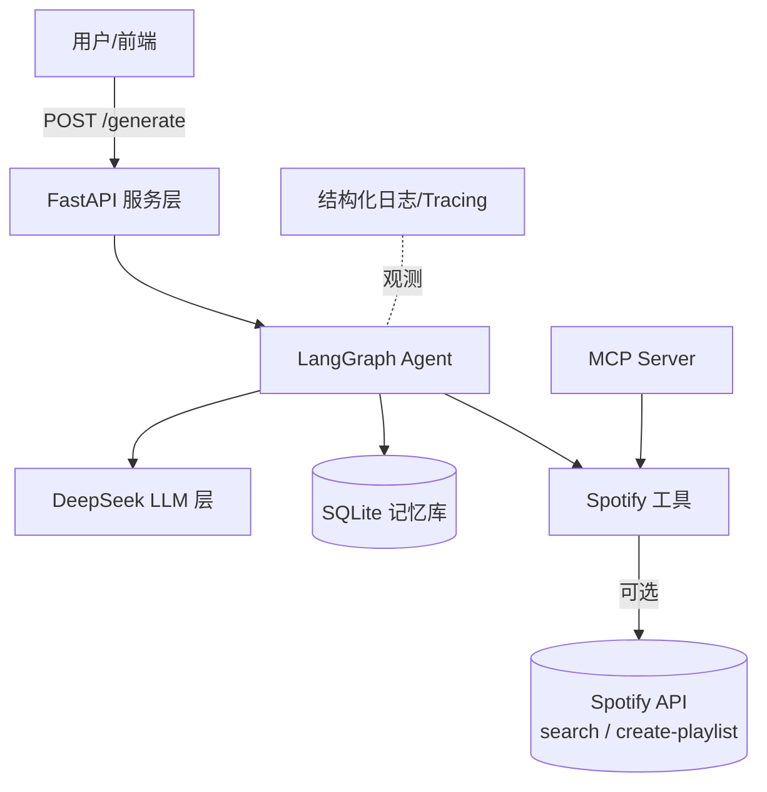
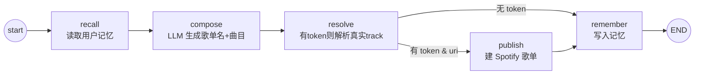

# Architecture Spec · Mood Agent

## 1. 总体架构

## 2. Agent 状态机（核心）

状态对象 `MoodState` 在节点间流转，字段含 `mood_description / num_songs /
user_id / spotify_token / history_context / playlist_name / songs /
spotify_playlist_url / error`。

## 3. 模块职责
| 模块 | 文件 | 职责 |
| --- | --- | --- |
| 配置 | `src/config.py` | 环境变量、特性开关（spotify_enabled / llm_ready） |
| LLM | `src/llm.py` | DeepSeek 调用（JSON / 文本），懒加载、可替换 |
| 记忆 | `src/memory.py` | SQLite 读写、历史上下文拼装 |
| 工具 | `src/tools.py` | Spotify search / create-playlist（未用任何已废弃端点） |
| Agent | `src/agent.py` | LangGraph 状态机定义与编排 |
| 服务 | `src/api.py` | FastAPI 端点 |
| MCP | `mcp_server.py` | 按 MCP 协议暴露音乐工具 |
| 观测 | `src/observability.py` | 结构化日志 + 节点 tracing 装饰器 |

## 4. 关键设计决策
- **为何 LangGraph**：把"理解→生成→解析→落地→记忆"显式建模为有向图，
  天然支持条件分支与可观测，便于扩展（如加入"风格批评 agent"做多智能体）。
- **为何 Spotify 仅用 search/create**：2024-11-27 起 recommendations、
  audio-features 等端点对新应用关闭；本架构让 LLM 承担"推荐"，
  Spotify 只做检索与落地，规避了该限制。
- **优雅降级**：无 Spotify token 时 `resolve/publish` 自动跳过，
  仅返回 LLM 歌单，保证 MVP 始终可演示。

## 5. 可扩展方向
- 多智能体：新增 curator / critic / DJ 三 agent 协作；
- Agentic RAG：接入曲库向量检索增强候选；
- 部署：Docker 化已就绪，可一键上云提供公网 URL。
